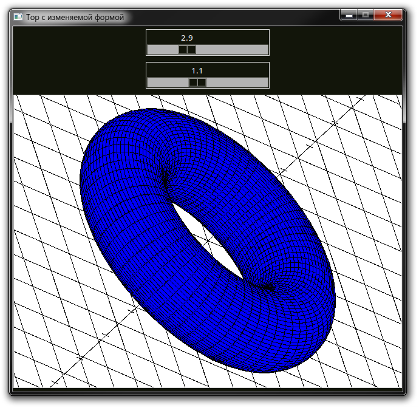
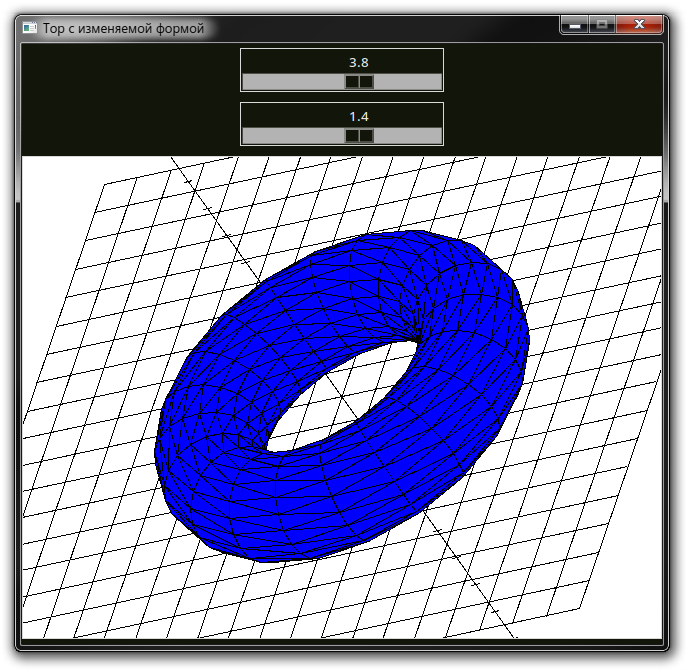
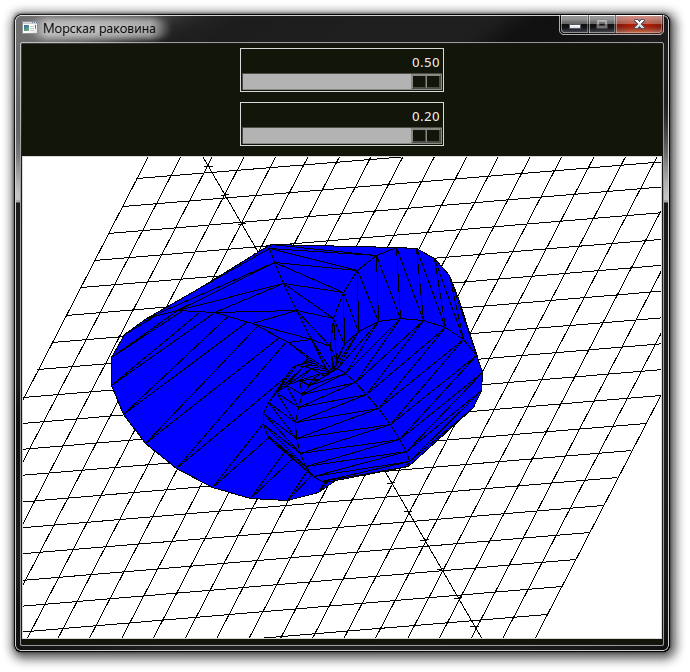
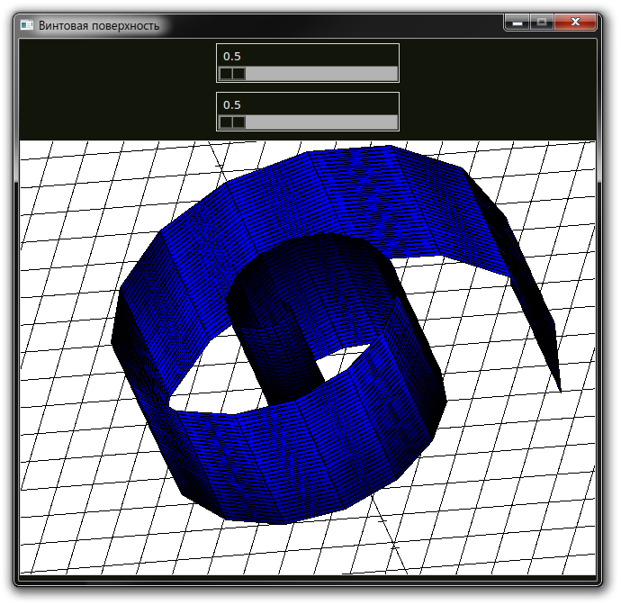
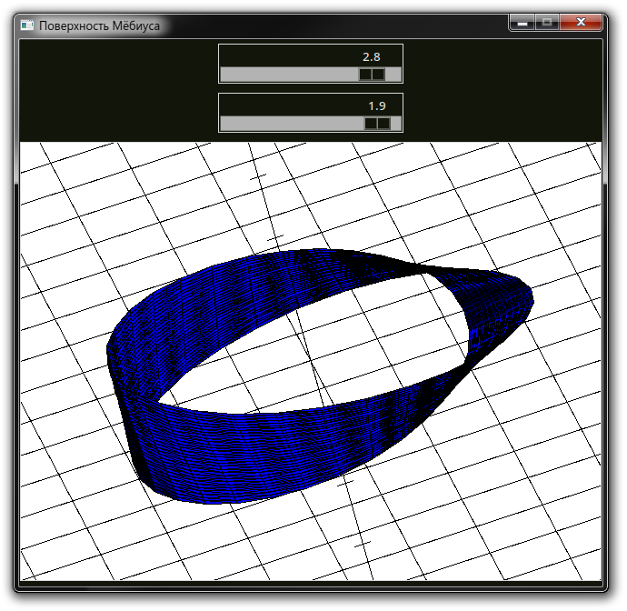
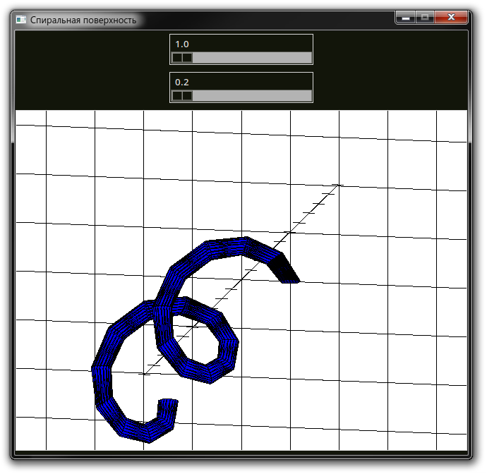

# Лабораторная работа по предмету "Линейная алгебра и вычислительные модели"

Содержит 5 поверхностей, заданных параметрической функцией:

* Спиральная поверхность
* Поверхность Мёбиуса
* Тор с изменяемой формой
* Винтовая поверхность
* Поверхность "ракушка"

# Описание реализации

## Графический интерфейс

Графический интерфейс лабораторной работы был написан с использованием набора инструментов Tk, его биндингов для ЯП Python (tkinter)

## 3D-графика

### Абстракция

В качестве абстракции вывода двумерных примитивов был использован виджет Canvas, его встроенные методы:

* `create_line` для вывода линий
* `create_polygon` для вывода закрашенных многоугольников 

### Положение камеры

Положение камеры можно изменять вдаль-вблизь (клавиши W-S), вертеть вокруг осей OX (стрелочки влево-вправо), OY (стрелочки вверх-вниз). Это реализовано с помощью матрицы линейных преобразований: поворота и перемещения. Заметим, что эту матрицу нужно посчитать единожды для фиксированного положения камеры, это помогает минимизировать количество вычислений тригонометрических функций.

### Алгоритм построения списка полигонов

В зависимости от параметра PRECISION в коде программы, выбирается количество параметров u, v, используемых для получения точек параметрического уравнения плоскости. Далее по соседним точкам строится треугольник или четырёхугольник (см. torrus-quad.py), заносится в список.

### Алгоритм рисования полигонов

Сначала полигоны сортируются от наиболее дальних от камеры к ближайшим, затем рисуются двумерные примитивы с точки зрения камеры, Z-координата просто игнорируется, ведь высчитанная матрица линейных преобразований перемещает точки нужным образом.

# Иллюстрации

