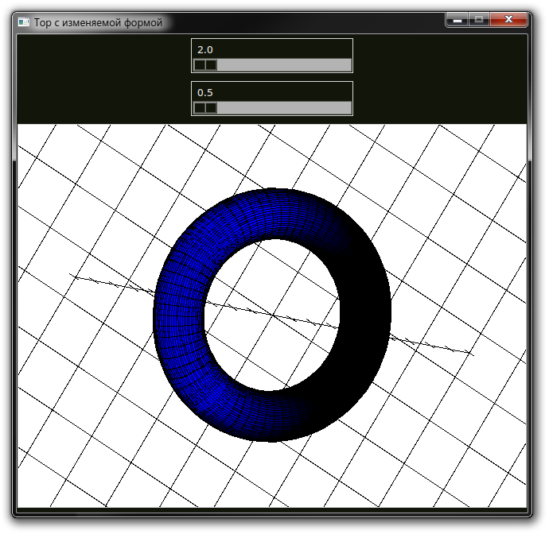
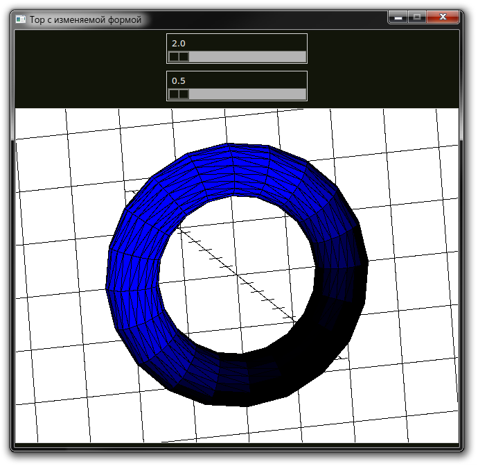
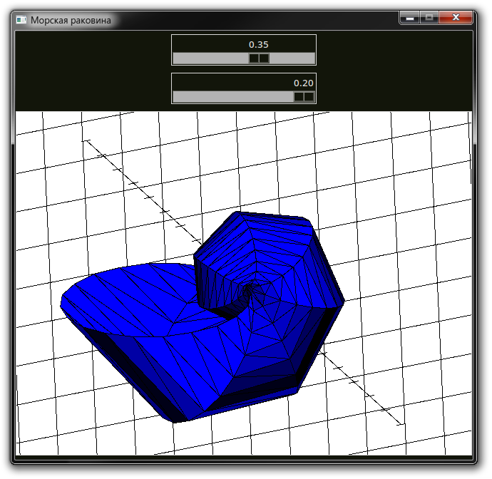

# Лабораторная работа №1 по предмету "Линейная алгебра и вычислительные модели"

Содержит 5 поверхностей, заданных параметрической функцией:

* Спиральная поверхность
* Поверхность Мёбиуса
* Тор с изменяемой формой
* Винтовая поверхность
* Поверхность "ракушка"

# Описание реализации

## Графический интерфейс

Графический интерфейс лабораторной работы был написан с использованием набора инструментов Tk, его биндингов для ЯП Python (tkinter)

## 3D-графика

### Абстракция

В качестве абстракции вывода двумерных примитивов был использован виджет Canvas, его встроенные методы:

* `create_line` для вывода линий
* `create_polygon` для вывода закрашенных многоугольников 

### Положение камеры

Положение камеры можно изменять вдаль-вблизь (клавиши W-S), вертеть вокруг осей OX (стрелочки влево-вправо), OY (стрелочки вверх-вниз). Это реализовано с помощью матрицы линейных преобразований: поворота и увеличения. Заметим, что эту матрицу нужно посчитать единожды для фиксированного положения камеры, это помогает минимизировать количество вычислений тригонометрических функций.

### Алгоритм построения списка полигонов

В зависимости от параметра PRECISION в коде программы, выбирается количество параметров u, v, используемых для получения точек параметрического уравнения плоскости. Далее по соседним точкам строится треугольник или четырёхугольник (см. torrus-quad.py), заносится в список.

### Алгоритм рисования полигонов

Сначала полигоны сортируются от наиболее дальних от камеры к ближайшим, затем рисуются двумерные примитивы с точки зрения "наблюдателя", Z-координата просто игнорируется, ведь высчитанная матрица линейных преобразований перемещает точки нужным образом.

### Освещение

Освещённость полигона определяется на основании его отдалённости от "наблюдателя": после домножения на матрицу преобразования берётся значение координаты Z. С ней производится следующие манипуляции: домножается на параметр интенсивности освещения, переводится в целое число, берётся абсолютное значение, если оно больше 255, то значение игнорируется. В некоторых случаях более целесообразно оказалось взять не абсолютное значение, а учитывать только "положительно" отдалённые полигоны.
Интенсивность заливки цвета определяется по отдалённости от "камеры", что есть Z-координата одной из вершин полигона после его линейного преобразования.

## Математическое описание

**Матрица камеры по-умолчанию**\
$$ C\footnote{Число 64 было выбрано для большего масштаба по-умолчанию} = \begin{pmatrix}
64 & 0 & 0 & 0\\
0 & 64 & 0 & 0\\
0 & 0 & 64 & 0\\
0 & 0 & 0 & 64
\end{pmatrix}$$

**Поворот вокруг оси OX**\
```math
R_{x}(\phi) = \begin{pmatrix}
1 & 0 & 0 & 0\\
0 & \cos \phi & -\sin \phi & 0\\
0 & \sin \phi & \cos \phi & 0\\
0 & 0 & 0 & 1
\end{pmatrix}
```
```math
C' = R_{x}(\phi) \cdot C\footnote{Матрица камеры}
```

**Поворот вокруг оси OY**\
```math
R_{y}(\phi) = \begin{pmatrix}
\cos \phi & 0 & \sin \phi & 0\\
0 & 1 & 0 & 0\\
-\sin \phi & 0 & \cos \phi & 0\\
0 & 0 & 0 & 1
\end{pmatrix}
```
```math
C' = R_{y}(\phi) \cdot C
```

**Поворот вокруг оси OZ**\
```math
R_{z}(\phi) = \begin{pmatrix}
\cos \phi & -\sin \phi & 0 & 0\\
\sin \phi & \cos \phi & 0 & 0\\
0 & 0 & 1 & 0\\
0 & 0 & 0 & 1
\end{pmatrix}
```
```math
C' = R_{z}(\phi) \cdot C
```

**Приближение/отдаление камеры**\
```math
C' = 1.1C
```
```math
C' = \frac{1}{1.1}C
```

**Проецирование полигона (треугольника)**\
```math
P = \begin{pmatrix}
p_{1 1} & p_{1 2} & p_{1 3} & 0\\
p_{2 1} & p_{2 2} & p_{2 3} & 0\\
p_{3 1} & p_{3 2} & p_{3 3} & 0\\
0 & 0 & 0 & 1
\end{pmatrix}
```
```math
P' = C \cdot P
```

# Иллюстрации








